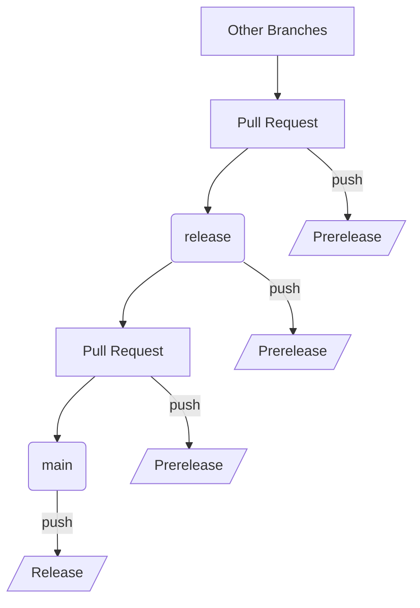

# Welcome to Smarty-Notebook Contributing Guide

Thank you for investing your time in contributing to this project. Any contributions you make are greatly appreciated.

## Getting Started

As a new contributor, please take a moment to read through this guide to understand how to contribute effectively:

- [Finding ways to contribute to open source on GitHub](https://docs.github.com/en/get-started/exploring-projects-on-github/finding-ways-to-contribute-to-open-source-on-github)
- [Set up Git](https://docs.github.com/en/get-started/git-basics/set-up-git)
- [GitHub flow](https://docs.github.com/en/get-started/using-github/github-flow)
- [Collaborating with pull requests](https://docs.github.com/en/github/collaborating-with-pull-requests)

### Branching Strategy

This project follows a modified GitHub flow that only focuses on two branches:

- `main`: Where the stable and ready-to-use code resides
- `release`: Where the code is prepared for the next production release

