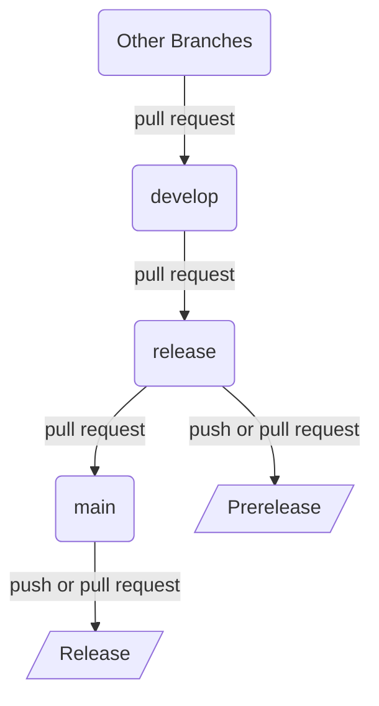

# Contributing

[](https://conventionalcommits.org)

Thank you for investing your time in contributing to this project. If you are new to contributing to open source projects, the following resources may be helpful:

- [Set up Git](https://docs.github.com/en/get-started/git-basics/set-up-git)
- [Collaborating with pull requests](https://docs.github.com/en/github/collaborating-with-pull-requests)
- [Signing commits](https://docs.github.com/en/authentication/managing-commit-signature-verification/signing-commits)

> [!Note]
> Signing commits is mandatory for this project.

## Setting Up a Development Environment

Please take a moment to read through [Setting Up a Local Environment](./../README.md#setting-up-a-local-environment) to ensure you have the necessary tools and dependencies installed. Once we have your local environment configured, install the development dependencies with:

```shell
poetry install --with dev
```

## Branching Strategy

This project follows a modified GitHub flow that only focuses on two branches:

- `main`: Where the stable and ready-to-use code resides
- `release`: Where the code is prepared for the next production release
- `develop`: Where the latest development changes are integrated before being merged into `release`



### Release Process

The release process has been automated using [Python Semantic Release](https://python-semantic-release.readthedocs.io/en/latest/) to ensure that all commit messages follow the [Conventional Commits](https://www.conventionalcommits.org/en/v1.0.0/), and the relevant constraints are defined in the [releaserc.toml](./../releaserc.toml) file and [GitHub Settings Rules](https://github.com/SiegeSailor/SmartyNotebooks/settings/rules). The releases and prereleases should be versioned well following [Branching Strategy](#branching-strategy). Note that there are no build, test, package, and publish steps for this project, as it only contains Jupyter Notebooks.

#### Commitlint

It is recommended to have `pre-commit` installed on your local end before pushing commits. Please make sure you already [Set Up a Development Environment](#setting-up-a-development-environment) before running the following command:

```shell
poetry run pre-commit install
```
