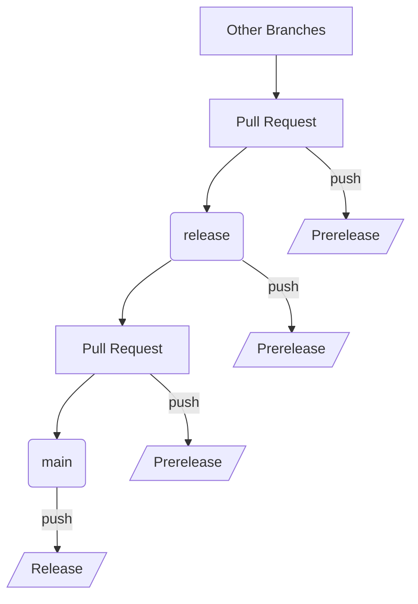

# Welcome to Smarty-Notebook Contributing Guide

Thank you for investing your time in contributing to this project. Please take a moment to read through [Setting Up a Local Environment](./../README.md#setting-up-a-local-environment) to ensure you have the necessary tools and dependencies installed. If you are new to contributing to open source projects, the following resources may be helpful:

- [Set up Git](https://docs.github.com/en/get-started/git-basics/set-up-git)
- [Collaborating with pull requests](https://docs.github.com/en/github/collaborating-with-pull-requests)
- [Signing commits](https://docs.github.com/en/authentication/managing-commit-signature-verification/signing-commits)

> [!Note]
> Signing commits is mandatory for this project.

### Branching Strategy

This project follows a modified GitHub flow that only focuses on two branches:

- `main`: Where the stable and ready-to-use code resides
- `release`: Where the code is prepared for the next production release

