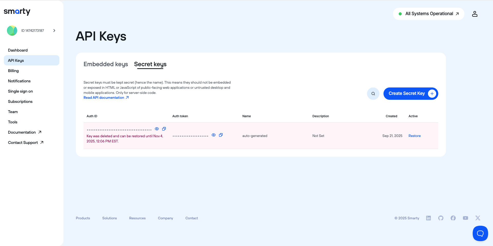

# Smarty Notebook

This repository contains Jupyter Notebooks that use the [Smarty Cloud API](https://www.smarty.com/docs/cloud) for various common tasks. Each notebook is designed to be self-contained and easy to use.

- [x] [Fetch U.S. ZIP+4 Code by Address](https://github.dev/SiegeSailor/Smarty-Notebook/blob/acceca93ca947daee2539b349f118fda7e312bb4/notebooks/fetch-us-zip4-by-address.ipynb)
- [ ] Fetch International Postal Code by Address

## Setting Up a Local Environment

Follow the steps below to set up your local environment for development. You can skip this section if you have other means of managing Python environments, such as [GitHub Codespaces](https://github.blog/changelog/2022-11-09-using-codespaces-with-jupyterlab-public-beta/) or [Google Colab](https://colab.google/).

### Prerequisites

- [`pyenv`](https://github.com/pyenv/pyenv)
- [`pyenv-virtualenv`](https://github.com/pyenv/pyenv-virtualenv)

### Setting Up a Virtual Environment

Create a virtual environment for the project:

```bash
pyenv install 3.11.13
pyenv virtualenv 3.11.13 smarty-notebook
pyenv activate smarty-notebook
```

> [!Note]
> You can use `pyenv local smarty-notebook` to set the virtual environment for the current directory.

### Installing Dependencies

To install the required dependencies, run the following command:

```bash
pip install --requirement ./requirements.txt
```

### Supplying Smarty API Credentials

To use the Smarty API, you need to provide your [key pairs](https://www.smarty.com/docs/cloud/authentication#keypairs). You can do this by creating a `.env` file with the following environment variables:

```shell
SMARTY_AUTH_ID="<smarty_auth_id>"
SMARTY_AUTH_TOKEN="<smarty_auth_token>"
```

> [!Note]
> You can obtain a free Smarty account and generate key pairs at [Smarty Sign Up](https://www.smarty.com/signup). You will see **API Keys** under your account dashboard. See the screenshot for _Smarty - Account - Dashboard - API Keys - Secret Keys_:
> 
